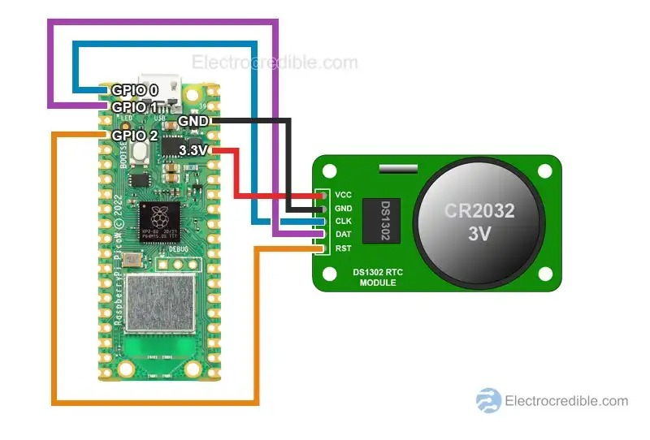

# DS1302 - Módulo de Reloj en Tiempo Real (RTC)

El DS1302 es un módulo de reloj en tiempo real (RTC) que permite llevar un registro preciso de la hora (segundos, minutos, horas) y la fecha (día, mes, año y día de la semana). Posee una pequeña batería que le permite mantener la información aun cuando el sistema principal se apaga. Se comunica con el microcontrolador mediante una interfaz **serial de tres hilos** (SCLK, I/O y CE), lo que lo hace fácil de integrar en sistemas embebidos.

El DS1302 es ideal para proyectos donde se requiere registrar eventos con fecha y hora o mantener el seguimiento del tiempo de forma autónoma.

# Uso aplicado en Newton 💻

El DS1302 se emplea para registrar la hora y fecha exacta en que comienzan a observarse cambios en el comportamiento del LED SMD, como por ejemplo fallos en la soldadura o funcionamiento errático. Esto permite relacionar el tiempo transcurrido con las condiciones ambientales registradas por el sensor DHT11, con el fin de analizar si existe una correlación entre ambos factores.

Además, contar con una referencia temporal ayuda a documentar mejor los experimentos y validar posibles hipótesis sobre el deterioro del LED en el tiempo.

# Conexiones aplicadas para el uso ⚙️

| Conexiones       | DS1302 | Raspberry Pi Pico |
| :--------------- | :----- | :---------------- |
| Alimentación     | VCC    | 3.3V (Pin 36)     |
| Tierra           | GND    | GND (Pin 38)      |
| Reloj (SCLK)     | SCLK   | GPIO (ej: GP2)    |
| Datos (I/O)      | I/O    | GPIO (ej: GP3)    |
| Chip Enable (CE) | CE     | GPIO (ej: GP4)    |

# Imagen de las Conexiones 📱

# Especificaciones del DS1302

[DS1302 Datasheet - Maxim Integrated](https://datasheets.maximintegrated.com/en/ds/DS1302.pdf)
